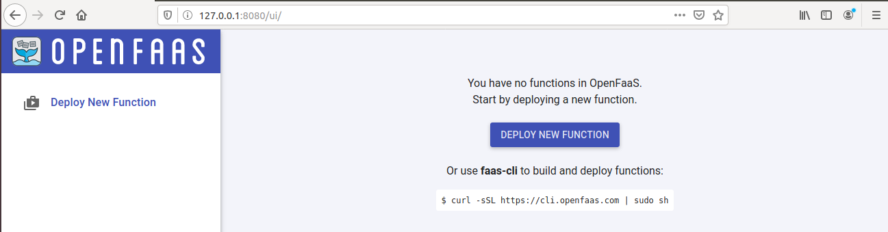
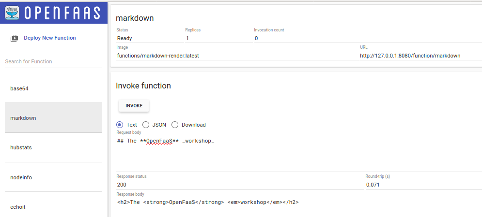
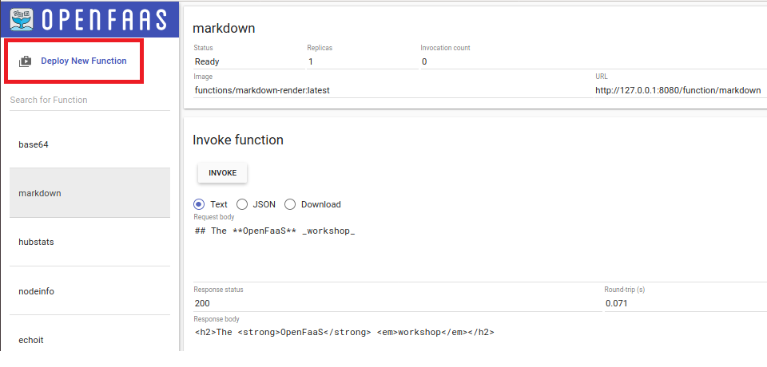
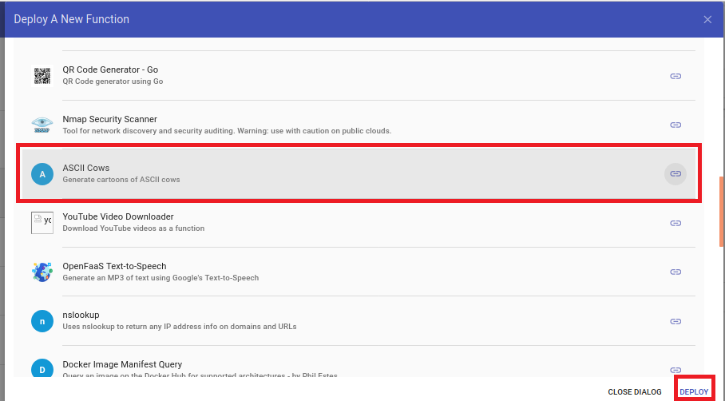
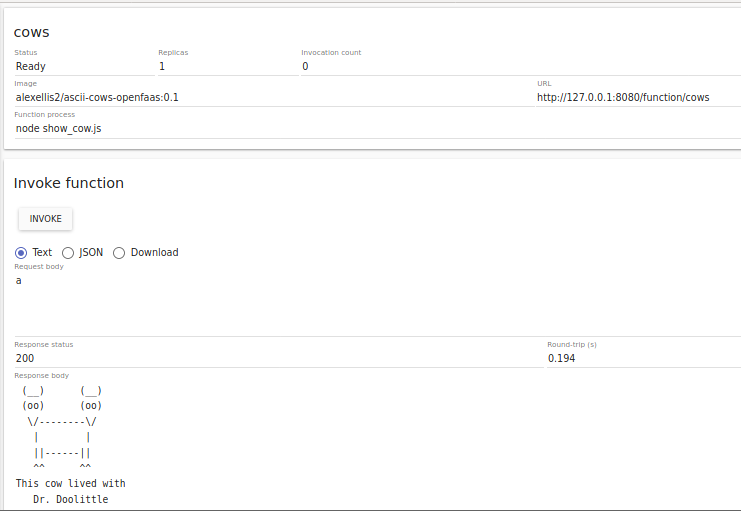
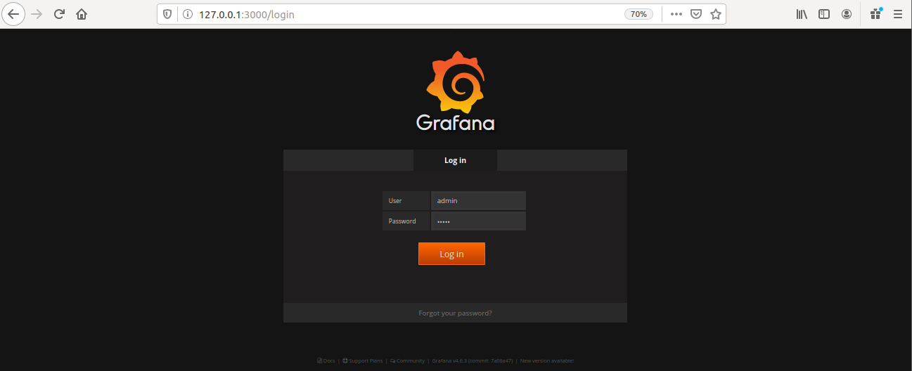
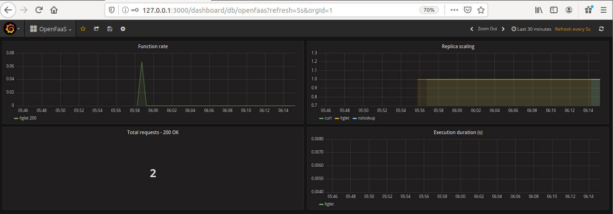

# Lab 2 - Test things out

## Giới thiệu UI Portal



Thử một số function có sẵn nào!

```
faas-cli deploy -f https://raw.githubusercontent.com/openfaas/faas/master/stack.yml
```

Thử hàm markdown. Hàm này có chức năng chuyển đổi markdown thành HTML

*input:*
```
## The **OpenFaaS** _workshop_
```
*output:*
```
<h2>The <strong>OpenFaaS</strong> <em>workshop</em></h2>
```



Bạn sẽ thấy một số trạng thái sau:
- Status: khi hiển thị Ready thì function mới có thể chạy.
- Replicas: số bản sao của function trên cluster
- Image: tên image và version đã có trên Docker Hub
- Invocation count: số lần gọi function và tự động cập nhật cứ mỗi 5 giây.

## Deploy function qua Store







## Tương tác với CLI

Khi các function trên không chạy trên UI, bạn có thể kiểm tra bằng `faas-cli`

```
faas-cli list --verbose

hoặc

aas-cli list -v
```

## Invoke a function

Thử function figlet

```
root@ubuntu:~# faas-cli invoke figlet
Reading from STDIN - hit (Control + D) to stop.
100
Handling connection for 8080
 _  ___   ___  
/ |/ _ \ / _ \ 
| | | | | | | |
| | |_| | |_| |
|_|\___/ \___/ 
               
```

## Bảng theo dõi (Monitoring dashboard)

OpenFaaS tự động theo dõi số liệu qua Prometheus. Để hiển thị ra bên ngoài ta dùng Grafana.

**Deploy Grafana**

```
kubectl -n openfaas create deploy --image=stefanprodan/faas-grafana:4.6.3 grafana
```

Expose ra ngoài qua port 3000

```
kubectl -n openfaas expose deployment grafana --type=NodePort --port=3000 --name=grafana
```

> Thực hiện forward để truy cập Grafana qua cổng 8080 với tham số `&` để chạy nền

```
kubectl port-forward deployment/grafana 3000:3000 -n openfaas &
```

Truy cập trang quản lý Grafana: http://127.0.0.1:3000



> Sử dụng tài khoản mặc định của Grafana để đăng nhập. Tài khoản:Mật khẩu `admin:admin`



Giờ qua [Lab3](lab3.md)