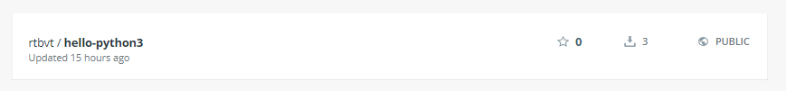

# Lab 3 - Introduction to Functions

## Sử dụng template có sẵn của OpenFaaS
Pull các template có sẵn về local

```
faas-cli template pull
```

Các ngôn ngữ mà `faas-cli` hỗ trợ
```
faas-cli new --list

root@ubuntu:~# faas-cli new --list
Languages available as templates:
- csharp
- csharp-armhf
- dockerfile
- go
- go-armhf
- java11
- java11-vert-x
- java8
- node
- node-arm64
- node-armhf
- node12
- php7
- python
- python-armhf
- python3
- python3-armhf
- python3-debian
- ruby
```

## Hello world in Python3

Bắt đầu tạo hàm Python
```
faas-cli new --lang python3 hello-python3 --prefix="<your-docker-username-here>"
```

Trong đó:
- --lang: ngôn ngữ chạy, lấy trong list template.
- hello-python3: tên fucntion sau này.
- --prefix: giúp đẩy images lên Docker Hub.
  
Thực hiện lệnh trên sẽ tạo ra các file
```
├── hello-python3
│   ├── handler.py
│   ├── __init__.py
│   └── requirements.txt
├── hello-python3.yml
```

> Lưu ý: phải cấu hình URL_OPENFAAS bằng: `export OPENFAAS_URL=127.0.0.1:8080` trước khi chạy các lệnh sau này

Nội dung file `YAML`
```
version: 1.0
provider:
  name: openfaas
  gateway: http://127.0.0.1:8080
functions:
  hello-python3:
    lang: python3
    handler: ./hello-python3
    image: rtbvt/hello-python3:latest
```

Nội dung trong file `handler.py`
```
def handle(req):
    """handle a request to the function
    Args:
        req (str): request body
    """

    return req
```

Để trả về Hello-World thì sửa return về
```
return "Hello World in Python3
```

> Trước khi build bạn đã đăng nhập Docker Huhb bằng `docker login` để sau khi build sẽ tự push lên Hub luôn.

```
faas-cli up -f hello-openfaas.yml
```

> Nếu không muốn dùng -f thì chỉ cần đổi tên `hello-python3.yml` thành `stack.yml`

Kiểm tra trên Docker Hub



Dùng `curl` để kiểm tra. Kết quả
```
root@ubuntu:~/lab3/6# curl http://127.0.0.1:8080/function/hello-python3
Handling connection for 8080
Hello World in Python3
```

## Hello world in Node


Bắt đầu tạo hàm
```
faas-cli new --lang node hello-node --prefix="<your-docker-username-here>"
```

Cấu trúc thư mục
```
├── hello-node
│   ├── handler.js
│   └── package.json
├── hello-node.yml
```

Nội dung file handler.js
```
"use strict"

module.exports = async (context, callback) => {
    return "Hello World in Node"
}
```

Thử đổi hello-node.yml thành stack và không cần dùng tham số -f để build
```
faas-cli up stack.yml
```

Dùng `curl` để kiểm tra. Kết quả
```
root@ubuntu:~/lab3/7# curl  http://127.0.0.1:8080/function/hello-node
Handling connection for 8080
Hello World in Node
```

## Combo hay ho về Hàm astronaut-finder

Hàm `astronaut-finder` sẽ gọi tên ngẫu nhiên của Nhà du hành vũ trụ ở International Space Station (ISS)

Bước 1: Tạo hàm
```
faas-cli new --lang python3 astronaut-finder --prefix="<your-docker-username-here>"
```

Bước 2: Sửa file trong ./astronaut-finder/requirements.txt. Thêm vào
```
requests
```

- Hàm này sẽ lấy dữ liệu từ http://api.open-notify.org/astros.json

Bước 3: Cập nhật `handler.py`
```
import requests
import random

def handle(req):
    r = requests.get("http://api.open-notify.org/astros.json")
    result = r.json()
    index = random.randint(0, len(result["people"])-1)
    name = result["people"][index]["name"]

    return "%s is in space" % (name)
```

Bước 4: build
```
faas-cli build -f astronaut-finder.yml
```

Bước 5: push

> Bước này để đẩy `images` lên Docker Hub
```
faas-cli push -f astronaut-finder.yml
```

Bước 6: deploy
```
faas-cli deploy -f astronaut-finder.yml
```

Bước 7: Test
```
echo | faas-cli invoke astronaut-finder
```

## Troubleshooting
Có 2 cách để troubleshoot
- Tìm logs của container chứa nó
  
```
kubectl logs deployment/astronaut-finder -n openfaas-fn
```

- Debug để in ra. Thêm "environment" vào file YAML

```
astronaut-finder:
    lang: python3
    handler: ./astronaut-finder
    image: astronaut-finder
    environment:
      write_debug: true

# Sau đó deploy lại file
faas-cli deploy -f ./astronaut-finder.yml

# Cuối cùng là xem logs
kubectl logs deployment/astronaut-finder -n openfaas-fn
```

## Quản lý nhiều function

Tạo function đầu tiên
```
faas-cli new --lang python3 first
```

Tạo thêm function thứ hai dựa trên function đầu tiên
```
faas-cli new --lang python3 second --append=./first.yml
```

Đổi tên file YAML
```
mv first.yml example.yml
```

Giờ kiểm tra trong file YAML có gì
```
provider:
  name: openfaas
  gateway: http://127.0.0.1:8080

functions:
  first:
    lang: python3
    handler: ./first
    image: first
  second:
    lang: python3
    handler: ./second
    image: second
```

Build hai hàm song song
```
faas-cli build -f ./example.yml --parallel=2
```

Để build 1 hàm thì ta dùng lệnh
```
faas-cli build -f ./example.yml --filter=second
```

## Custom templates (Mẫu tùy chọn)

Sử dụng mẫu của bạn, ví dụ ở đây dùng Python3 sử dụng Debian Linux
```
faas-cli template pull https://github.com/openfaas-incubator/python3-debian
```

Kiểm tra lại danh sách
```
faas-cli new --list
```

Tất cả các template mới đều lưu ở thư mục `./templates/`

## Custom templates: Template Store (Mẫu tùy chọn trong Store)

Kiểm tra trên Store
```
faas-cli template store list -v
```

Hoặc dùng tham số `describe`
```
faas-cli template store describe go

# output
root@ubuntu:~/lab3# faas-cli template store describe go

Name:              go
Platform:          x86_64
Language:          Go
Source:            openfaas
Description:       Classic Golang template
Repository:        https://github.com/openfaas/templates
Official Template: true
```

Pull từ Store về
```
faas-cli template store pull go
```

*Sau đó tạo mới function và dùng như các bước trên*

## Custom binaries as functions (optional exercise)

Tự tạo riêng `Dockerfile` cho bạn
```
faas-cli new --lang dockerfile sorter --prefix="<your-docker-username-here>"
```

Sửa biến môi trường
```
ENV fprocess="sort"
```

Giờ build, push và deploy function
```
faas-cli up -f sorter.yml
```

Kiểm tra
```
$ echo -n '
elephant
zebra
horse
aardvark
monkey'| faas-cli invoke sorter

# output
aardvark
elephant
horse
monkey
zebra
```

Giờ, qua [Lab4](lab4.md) nào!